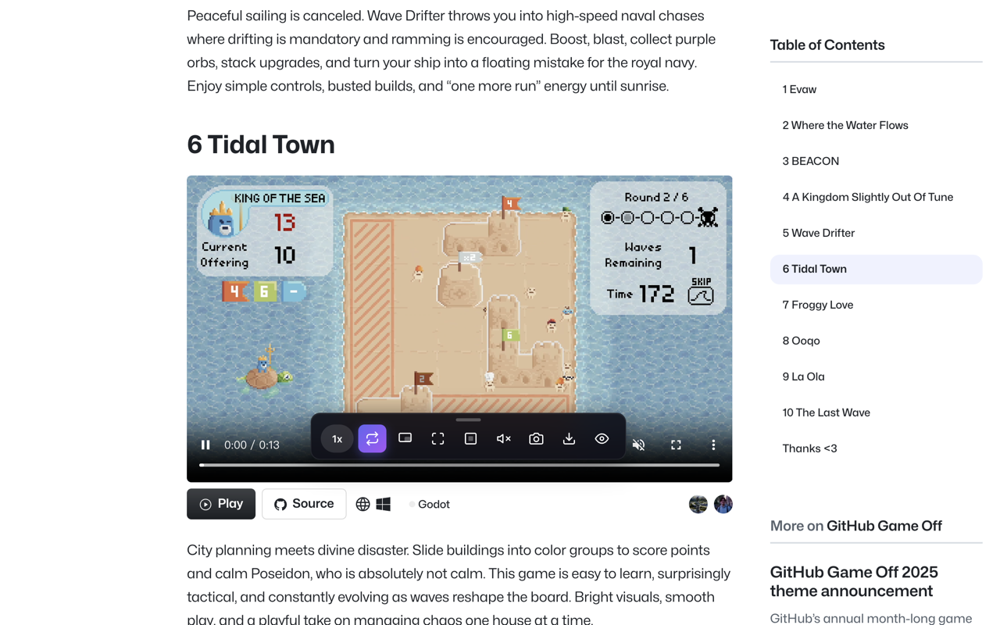
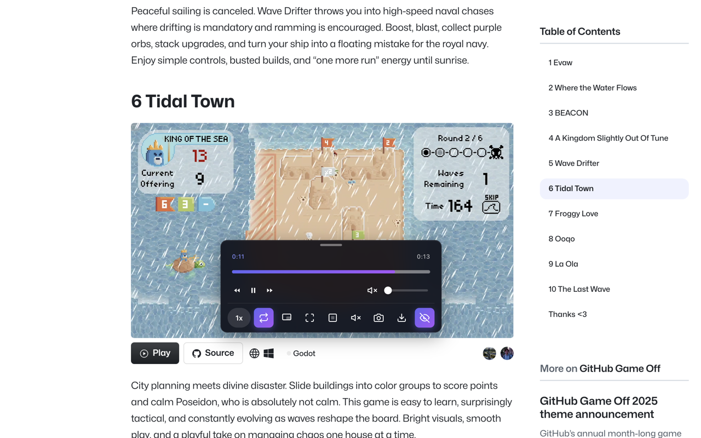

# Video Companion

增强网页视频播放体验的 Chrome 扩展 - 画中画、全屏、倍速控制等





## 功能特性

- **画中画模式** - 将视频悬浮在其他窗口之上
- **网页全屏** - 让视频充满整个浏览器窗口
- **倍速控制** - 自定义播放速度 (0.25x - 16x)
- **视频截图** - 一键截取当前视频画面
- **视频下载** - 下载当前播放的视频
- **循环播放** - 开启/关闭视频循环
- **静音控制** - 快速切换静音状态
- **隐藏控制栏** - 隐藏原生视频控制条

## 快捷键

| 功能 | 快捷键 |
|------|--------|
| 画中画 | `Alt + P` |
| 全屏 | `Alt + Shift + F` |
| 加速 | `Alt + Shift + >` |
| 减速 | `Alt + Shift + <` |

## 安装

### 从源码安装

1. 克隆仓库
```bash
git clone https://github.com/wh131462/video-companion-extension.git
cd video-companion-extension
```

2. 安装依赖
```bash
npm install
```

3. 构建扩展
```bash
npm run build
```

4. 加载扩展
   - 打开 Chrome 浏览器，访问 `chrome://extensions/`
   - 开启「开发者模式」
   - 点击「加载已解压的扩展程序」
   - 选择项目的 `dist` 目录

## 开发

```bash
# 开发模式
npm run dev

# 运行测试
npm test

# 类型检查
npm run type-check

# 代码检查
npm run lint

# 构建并打包 zip
npm run build:zip
```

## 技术栈

- TypeScript
- Vite
- Chrome Extension Manifest V3
- Vitest

## 浏览器兼容性

- Chrome 122+

## 许可证

[MIT](LICENSE)

## 作者

[EternalHeart](https://github.com/wh131462)
