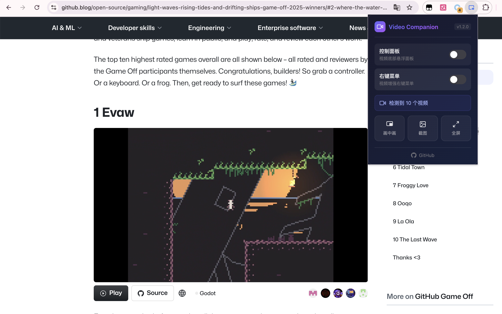
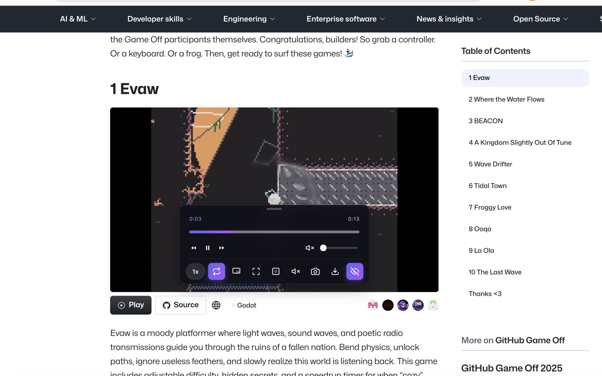
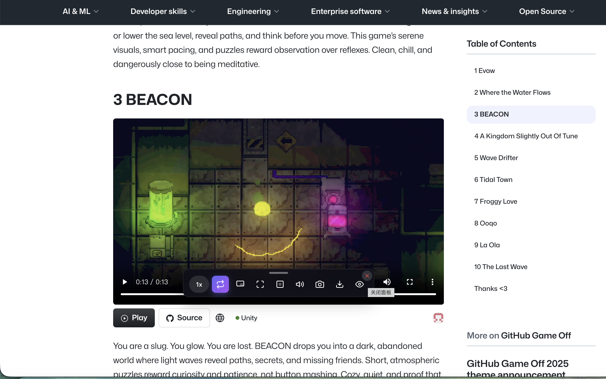
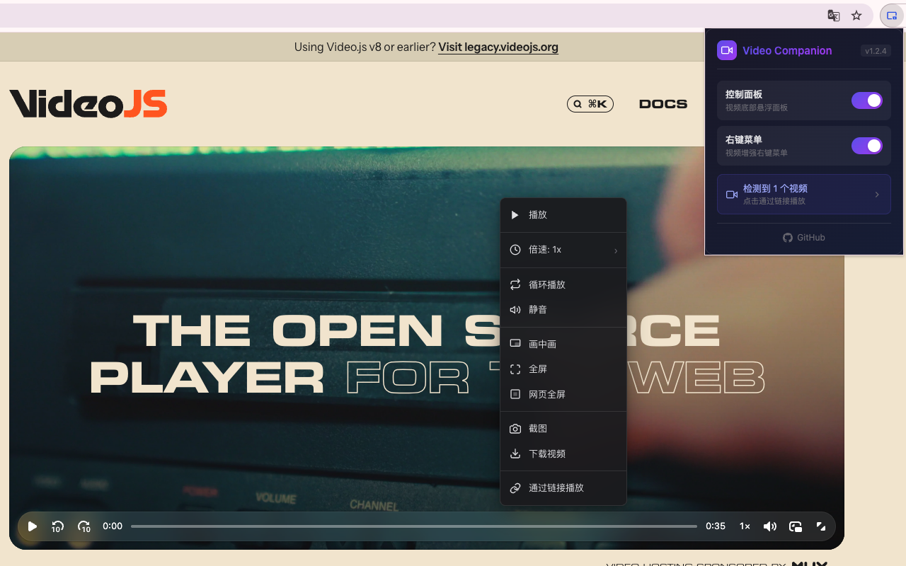
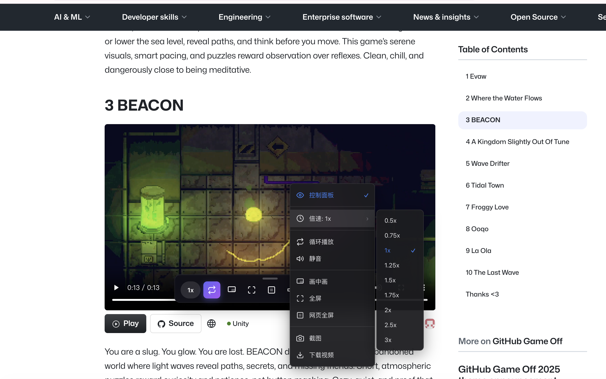

# Video Companion

增强网页视频播放体验的 Chrome 扩展 - 画中画、全屏、倍速控制等

## 截图预览

| 弹窗面板 | 视频控制面板 |
|:---:|:---:|
|  |  |

| 可关闭面板 | 右键菜单 |
|:---:|:---:|
|  |  |

| 倍速子菜单 |
|:---:|
|  |

## 功能特性

### 视频控制
- **画中画模式** - 将视频悬浮在其他窗口之上
- **全屏播放** - 原生全屏模式
- **网页全屏** - 让视频充满整个浏览器窗口
- **倍速控制** - 自定义播放速度 (0.25x - 16x)
- **循环播放** - 开启/关闭视频循环
- **静音控制** - 快速切换静音状态

### 视频工具
- **视频截图** - 一键截取当前视频画面并下载
- **视频下载** - 下载当前播放的视频

### 智能适配
- **自动检测** - 智能识别 YouTube、Bilibili、腾讯视频、爱奇艺、优酷等主流视频网站
- **右键菜单增强** - 所有视频均支持右键菜单快速操作
- **控制面板** - 原生 video 元素显示悬浮控制面板，自定义播放器仅提供右键菜单

### 扩展管理
- **弹窗面板** - 点击扩展图标打开设置面板，可独立开关控制面板和右键菜单
- **快捷操作** - 弹窗面板提供画中画、截图、全屏快捷按钮
- **状态记忆** - 记住每个视频的面板显示状态
- **拖拽移动** - 控制面板支持拖拽到任意位置

## 使用方式

### 右键菜单
在任意视频上点击右键，即可看到增强菜单：
- 控制面板（显示/隐藏）
- 倍速调节（子菜单）
- 循环播放 ✓
- 静音 ✓
- 画中画
- 全屏 / 退出全屏
- 网页全屏
- 截图
- 下载视频

### 控制面板
对于原生 video 元素，会在视频底部显示悬浮控制面板：
- 鼠标悬停时显示，离开后自动隐藏
- 可拖拽移动到任意位置
- 点击关闭按钮可隐藏面板
- 通过右键菜单可重新唤出

### 弹窗面板
点击浏览器工具栏的扩展图标打开弹窗面板：
- **控制面板开关** - 开启/关闭视频底部悬浮控制面板
- **右键菜单开关** - 开启/关闭视频右键增强菜单
- **视频检测** - 显示当前页面检测到的视频数量
- **快捷按钮** - 画中画、截图、全屏一键操作

## 快捷键

| 功能 | 快捷键 |
|------|--------|
| 画中画 | `Alt + P` |
| 全屏 | `Alt + Shift + F` |
| 加速 | `Alt + Shift + >` |
| 减速 | `Alt + Shift + <` |

## 安装

### 从 Chrome 网上应用店安装（推荐）

[](https://chromewebstore.google.com/detail/video-companion/nmkklhdipnadeimbnimllidjgccbifhm)

[**点击安装 Video Companion**](https://chromewebstore.google.com/detail/video-companion/nmkklhdipnadeimbnimllidjgccbifhm)

### 从源码安装

1. 克隆仓库
```bash
git clone https://github.com/wh131462/video-companion-extension.git
cd video-companion-extension
```

2. 安装依赖
```bash
npm install
```

3. 构建扩展
```bash
npm run build
```

4. 加载扩展
   - 打开 Chrome 浏览器，访问 `chrome://extensions/`
   - 开启「开发者模式」
   - 点击「加载已解压的扩展程序」
   - 选择项目的 `dist` 目录

## 开发

```bash
# 开发模式（热重载）
npm run dev

# 构建生产版本
npm run build

# 构建并打包 zip（用于发布）
npm run build:zip

# 运行测试
npm test

# 测试覆盖率
npm run test:coverage

# 类型检查
npm run type-check

# 代码检查
npm run lint
```

### 项目结构

```
src/
├── background/        # Service Worker 后台脚本
│   ├── handlers/      # 消息和命令处理器
│   └── services/      # 存储服务
├── content/           # 内容脚本
│   ├── core/          # 核心逻辑（视频扫描、增强器）
│   ├── features/      # 功能模块（倍速、截图、下载等）
│   ├── handlers/      # 事件处理器
│   ├── styles/        # 样式文件
│   ├── ui/            # UI 组件（控制面板、右键菜单、Toast）
│   └── utils/         # 工具函数
└── shared/            # 共享代码（类型、常量、工具）
```

## 技术栈

- **TypeScript** - 类型安全的 JavaScript
- **Vite** - 现代化构建工具
- **Chrome Extension Manifest V3** - 最新扩展规范
- **Vitest** - 单元测试框架

## 支持的网站

扩展会自动检测以下网站的自定义播放器，仅提供右键菜单增强：
- YouTube
- Bilibili（哔哩哔哩）
- 腾讯视频
- 爱奇艺
- 优酷
- 西瓜视频

对于其他使用原生 video 元素的网站，将同时显示控制面板和右键菜单。

## 浏览器兼容性

- Chrome 122+
- Edge 122+ (Chromium)

## 许可证

[MIT](LICENSE)

## 作者

[EternalHeart](https://github.com/wh131462)

## 反馈与贡献

欢迎提交 [Issue](https://github.com/wh131462/video-companion-extension/issues) 或 [Pull Request](https://github.com/wh131462/video-companion-extension/pulls)
