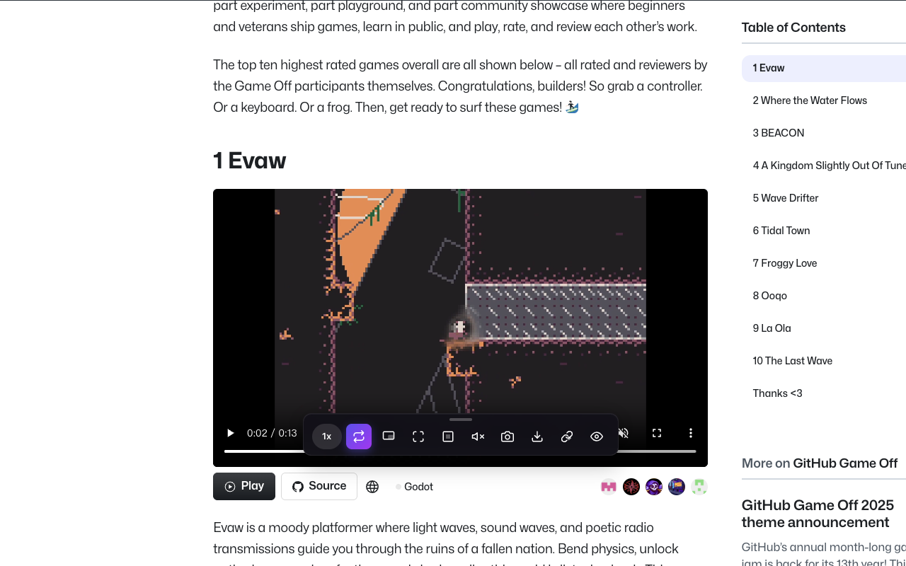
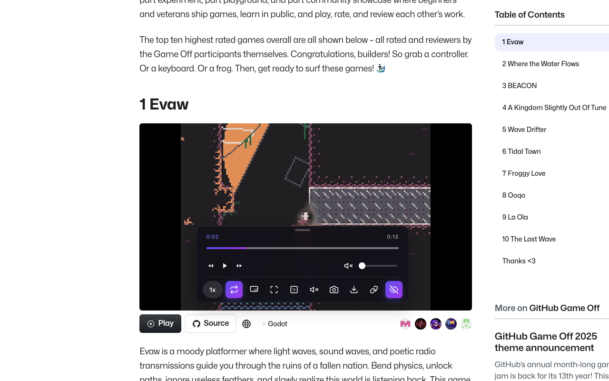
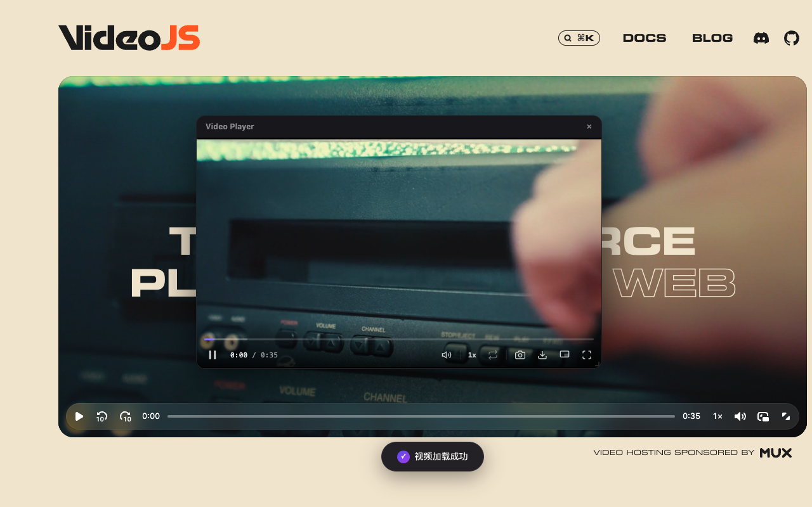
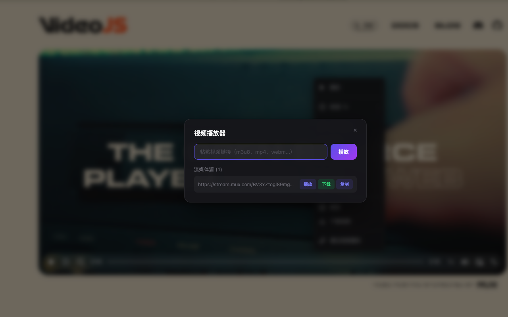

# Video Companion

**中文** | [English](README.md)

> 网页视频增强工具 - 画中画、倍速 (0.25x-16x)、截图、下载、网页全屏，支持 YouTube/B站/腾讯视频等主流平台

[](https://chromewebstore.google.com/detail/video-companion/nmkklhdipnadeimbnimllidjgccbifhm)
[](https://chromewebstore.google.com/detail/video-companion/nmkklhdipnadeimbnimllidjgccbifhm)
[](LICENSE)

## 为什么选择 Video Companion？

大多数视频平台只提供有限的播放控制。Video Companion 打破这些限制，把控制权交还给你：

- **随心播放** — 讲座视频加速到 16 倍，教程慢放到 0.25 倍，精细调速找到你的最佳节奏。
- **画中画多任务** — 将视频悬浮在浏览器之上，边看视频边工作、浏览网页或记笔记。
- **一键保存** — 即时截取任意画面，或下载视频（包括 HLS/m3u8 流媒体）供离线观看。
- **链接直播** — 粘贴 m3u8、mp4 或 webm 链接直接播放，无需额外软件。
- **沉浸观看** — 网页全屏模式填满浏览器窗口而不进入系统全屏，还可隐藏原生控制栏获得更干净的画面。
- **轻量无广告，尊重隐私** — 无需注册账号，不收集任何数据，没有广告。完全在浏览器本地运行。

## 截图预览

| 控制面板（默认） | 控制面板（隐藏原生控制器） |
|:---:|:---:|
|  |  |

| 右键菜单 | 自定义播放器 |
|:---:|:---:|
|  |  |

| 通过链接播放 |
|:---:|
|  |

## 功能特性

### 🎬 视频控制
| 功能 | 说明 |
|------|------|
| 画中画模式 | 将视频悬浮在其他窗口之上，边看边操作 |
| 全屏播放 | 原生全屏模式 |
| 网页全屏 | 视频充满浏览器窗口，无需进入系统全屏 |
| 倍速控制 | 0.25x - 16x 自由调速，精细控制播放节奏 |
| 循环播放 | 开启/关闭视频循环 |
| 静音控制 | 快速切换静音状态 |

### 🛠 视频工具
| 功能 | 说明 |
|------|------|
| 视频截图 | 一键截取当前画面并下载为 PNG |
| 视频下载 | 下载当前视频，支持 HLS (m3u8) 流媒体下载 |
| 通过链接播放 | 输入任意视频 URL 播放，支持 m3u8、mp4、webm 等格式 |
| 流媒体源检测 | 自动拦截页面中的 m3u8 流媒体地址 |
| 隐藏原生控制器 | 隐藏浏览器默认视频控制栏，使用扩展控制面板替代 |

### 🌐 智能适配
- **自动检测** - 智能识别 YouTube、Bilibili、腾讯视频、爱奇艺、优酷、西瓜视频等主流平台
- **右键菜单增强** - 所有视频均支持右键菜单快速操作
- **控制面板** - 原生 video 元素显示悬浮控制面板，自定义播放器仅提供右键菜单

### ⚙ 扩展管理
- **弹窗面板** - 点击扩展图标打开设置面板，可独立开关控制面板和右键菜单
- **语言切换** - 在弹窗面板中切换中文/英文界面
- **状态记忆** - 记住每个视频的面板显示状态
- **拖拽移动** - 控制面板支持拖拽到任意位置

## 使用方式

### 右键菜单
在任意视频上点击右键，即可看到增强菜单：
- 播放/暂停
- 倍速调节（子菜单）
- 循环播放 ✓
- 静音 ✓
- 画中画
- 全屏 / 退出全屏
- 网页全屏
- 截图
- 下载视频
- 通过链接播放

### 控制面板
对于原生 video 元素，会在视频底部显示悬浮控制面板：
- 鼠标悬停时显示，离开后自动隐藏
- 可拖拽移动到任意位置
- 点击关闭按钮可隐藏面板
- 通过右键菜单可重新唤出

### 弹窗面板
点击浏览器工具栏的扩展图标打开弹窗面板：
- **控制面板开关** - 开启/关闭视频底部悬浮控制面板
- **右键菜单开关** - 开启/关闭视频右键增强菜单
- **语言切换** - 在中文和英文之间切换界面语言
- **视频检测** - 显示当前页面检测到的视频数量
- **快捷按钮** - 画中画、截图、全屏一键操作

## 快捷键

| 功能 | 快捷键 |
|------|--------|
| 画中画 | `Alt + P` |

## 安装

### 从 Chrome 网上应用店安装（推荐）

[**👉 点击安装 Video Companion**](https://chromewebstore.google.com/detail/video-companion/nmkklhdipnadeimbnimllidjgccbifhm)

### 从源码安装

1. 克隆仓库
```bash
git clone https://github.com/wh131462/video-companion-extension.git
cd video-companion-extension
```

2. 安装依赖
```bash
npm install
```

3. 构建扩展
```bash
npm run build
```

4. 加载扩展
   - 打开 Chrome 浏览器，访问 `chrome://extensions/`
   - 开启「开发者模式」
   - 点击「加载已解压的扩展程序」
   - 选择项目的 `dist` 目录

## 开发

```bash
# 开发模式（热重载）
npm run dev

# 构建生产版本
npm run build

# 构建并打包 zip（用于发布）
npm run build:zip

# 运行测试
npm test

# 测试覆盖率
npm run test:coverage

# 类型检查
npm run type-check

# 代码检查
npm run lint
```

### 项目结构

```
src/
├── background/        # Service Worker 后台脚本
│   ├── handlers/      # 消息和命令处理器
│   └── services/      # 存储服务
├── content/           # 内容脚本
│   ├── core/          # 核心逻辑（视频扫描、增强器）
│   ├── features/      # 功能模块（倍速、截图、下载等）
│   ├── handlers/      # 事件处理器
│   ├── hls/           # HLS 流媒体（播放器、下载器、拦截器）
│   ├── styles/        # 样式文件
│   ├── ui/            # UI 组件（控制面板、右键菜单、Toast）
│   └── utils/         # 工具函数
└── shared/            # 共享代码（类型、常量、工具）
```

## 技术栈

- **TypeScript** - 类型安全的 JavaScript
- **Vite** - 现代化构建工具
- **Chrome Extension Manifest V3** - 最新扩展规范
- **Vitest** - 单元测试框架

## 支持的网站

扩展会自动检测以下网站的自定义播放器，仅提供右键菜单增强：

| 平台 | 网址 |
|------|------|
| YouTube | youtube.com |
| Bilibili（哔哩哔哩） | bilibili.com |
| 腾讯视频 | v.qq.com |
| 爱奇艺 | iqiyi.com |
| 优酷 | youku.com |
| 西瓜视频 | ixigua.com |

对于其他使用原生 `<video>` 元素的网站，将同时显示控制面板和右键菜单。

## 浏览器兼容性

| 浏览器 | 最低版本 |
|--------|----------|
| Chrome | 122+ |
| Edge (Chromium) | 122+ |

## 许可证

[MIT](LICENSE)

## 作者

[EternalHeart](https://github.com/wh131462)

## 反馈与贡献

如果你在使用中遇到问题或有新功能建议，欢迎提交 [Issue](https://github.com/wh131462/video-companion-extension/issues) 或 [Pull Request](https://github.com/wh131462/video-companion-extension/pulls)。
